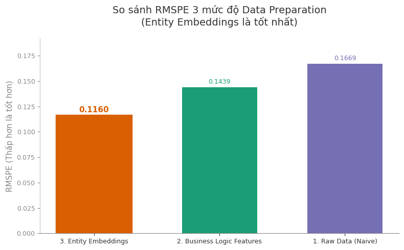

# Rossmann Store Sales – Sức mạnh của Data Preparation qua Data Storytelling



*Hình 1 – Cùng một mô hình XGBoost, RMSPE giảm từ **0.1669** (Raw Data) xuống **0.1439** (Business Logic Features) và còn **0.1160** khi dùng Entity Embeddings.*

> **Môn học:** Data Storytelling & Data Preparation
> **Mục tiêu:** Dùng bộ dữ liệu Rossmann Store Sales (Kaggle) để chứng minh vai trò của
> **Data Preparation** trong việc xây dựng mô hình dự báo doanh thu cho chuỗi bán lẻ.

---

## 1. Bối cảnh & Mục tiêu

Rossmann là một chuỗi bán lẻ dược phẩm với hơn 1.000 cửa hàng tại châu Âu.
Bài toán đặt ra:

> Dự báo **doanh thu theo ngày của từng cửa hàng** dựa trên lịch sử bán hàng,
> thông tin ngày tháng, chương trình khuyến mãi, cạnh tranh, v.v.

Trong project này, chúng mình:

1. **Khảo sát & kể chuyện với dữ liệu** (EDA, seasonality, cạnh tranh, promo).
2. **Xây các pipeline chuẩn bị dữ liệu**:

   * RAW (Naive),
   * Business Logic Features (CLEAN),
   * Entity Embeddings cho các biến phân loại.
3. **So sánh chất lượng mô hình** (RMSPE) giữa các pipeline, và
4. **Trình bày kết quả dưới dạng Data Storytelling**, tập trung vào việc:

   > *Cùng một mô hình, cùng một bài toán – nhưng cách chuẩn bị dữ liệu khác nhau
   > có thể tạo ra chất lượng dự báo hoàn toàn khác nhau.*

Để xem mô tả ngắn gọn bài toán, phạm vi và giả định, có thể tham khảo thêm
**[docs/project_overview.md](docs/project_overview.md)**.
Phần thiết kế câu chuyện, flow và key message được mô tả chi tiết trong
**[docs/storytelling_design.md](docs/storytelling_design.md)**.

---

## 2. Bộ dữ liệu

Nguồn dữ liệu: **Rossmann Store Sales** trên Kaggle
([https://www.kaggle.com/c/rossmann-store-sales](https://www.kaggle.com/c/rossmann-store-sales))

Các file chính:

* `data/train.csv` – Dữ liệu train lịch sử: doanh thu, số khách, trạng thái mở cửa, promo, v.v.
* `data/test.csv` – Dữ liệu test dùng cho submission Kaggle (không có cột `Sales`).
* `data/store.csv` – Thông tin tĩnh về từng cửa hàng (StoreType, Assortment, cạnh tranh, Promo2…).
* `data/sample_submission.csv` – File submission mẫu của Kaggle.

Trong project này, chúng mình chủ yếu sử dụng `train.csv` và `store.csv` để:

* Khảo sát dữ liệu,
* Xây các pipeline Feature Engineering,
* Và huấn luyện / so sánh mô hình.

> Giải thích chi tiết ý nghĩa từng cột (cả trong `train.csv` và `store.csv`) được tổng hợp
> trong file **[docs/data_dictionary.md](docs/data_dictionary.md)**.

---

## 3. Cấu trúc repository

```text
.
├─ data/                     # Dữ liệu thô từ Kaggle
│  ├─ sample_submission.csv
│  ├─ store.csv
│  ├─ test.csv
│  └─ train.csv
│
├─ data_preparation/         # Code Python phục vụ chuẩn bị dữ liệu & mô hình
│  ├─ __init__.py
│  ├─ processors.py          # Các class FeatureGenerator (RAW, CLEAN, EntityEmbedding, ...)
│  ├─ evaluator.py           # RossmannComparer: train/eval XGBoost, plot learning curve, lưu prediction
│  ├─ models.py              # Định nghĩa EntityEmbeddingModel và các model PyTorch liên quan
│  └─ checkpoints/           # Nơi lưu checkpoint .pth cho Entity Embeddings
│
├─ docs/                     # Tài liệu mô tả dự án (Markdown)
│  ├─ data_dictionary.md     # Miêu tả ý nghĩa các cột trong train/store
│  ├─ project_overview.md    # Mô tả ngắn gọn bài toán, phạm vi, giả định
│  └─ storytelling_design.md # Outline, flow và key message cho phần Data Storytelling (slide/PDF)
│
├─ notebooks/                # Jupyter notebooks theo từng "chương" phân tích
│  ├─ 01.Understand_EDA.ipynb
│  │    # Chương 1 – Khám phá dữ liệu: phân phối Sales, khách, holiday, open/close, ...
│  ├─ 02.Sales_seasonality_analysis.ipynb
│  │    # Phân tích mùa vụ: theo ngày trong tuần, tháng, năm, holiday vs non-holiday
│  ├─ 03.competitor analysis.ipynb
│  │    # Phân tích cạnh tranh: CompetitionDistance, thời điểm đối thủ xuất hiện, ...
│  ├─ 04.PROMO_.ipynb
│  │    # Phân tích Promo & Promo2: hành vi khi có/không có khuyến mãi, hiệu ứng theo thời gian
│  └─ 05.Data_Preparation.ipynb
│       # Notebook chính cho Chương 2:
│       # - Định nghĩa pipeline RAW / Business Logic Features / Entity Embeddings
│       # - Train XGBoost với tham số cố định
│       # - So sánh RMSPE, vẽ Actual vs Predicted, phân tích không gian embedding
│
├─ figures/                  # Hình minh họa chính (biểu đồ đưa vào slide/README)
│  └─ rmspe_dataprep.png     # Hình so sánh RMSPE 3 mức độ Data Preparation
│
├─ reports/
│  └─ tmp/
│     ├─ Dataprep_comparation.ipynb
│     │    # Notebook thử nghiệm cho phần so sánh pipeline & phân tích embedding (bản nháp)
│     └─ Model_comparation.ipynb
│          # Notebook thử nghiệm cho phần vẽ biểu đồ RMSPE/learning curve (bản nháp)
│
├─ .gitignore                # Bỏ qua các file không cần track (checkpoints, output tạm, v.v.)
├─ README.md                 # File mô tả dự án (chính là file bạn đang đọc)
└─ requirements.txt          # Danh sách thư viện Python cần thiết
```

Nếu muốn hiểu sâu hơn về logic kể chuyện tổng thể (tại sao lại chia thành các chương, thứ tự notebook, key message từng phần), có thể xem thêm **[docs/storytelling_design.md](docs/storytelling_design.md)** song song với việc duyệt qua thư mục `notebooks/`.

---

## 4. Cách cài đặt & chạy project

### 4.1. Yêu cầu môi trường

* Python 3.9+ (khuyến nghị dùng Conda)
* Một environment mới, ví dụ `dataviz` hoặc `rossmann`
* Có thể dùng GPU nếu muốn train nhanh hơn cho phần Entity Embeddings (PyTorch)

### 4.2. Tạo environment & cài đặt thư viện

```bash
# Tạo env mới (ví dụ dùng conda)
conda create -n dataviz python=3.10
conda activate dataviz

# Cài đặt các thư viện cần thiết
pip install -r requirements.txt
```

> Nếu dùng GPU, hãy cài PyTorch bản tương ứng với CUDA theo hướng dẫn từ trang chủ PyTorch,
> rồi mới chạy `pip install -r requirements.txt`.

### 4.3. Chuẩn bị dữ liệu

1. Tải bộ data **Rossmann Store Sales** từ Kaggle.
2. Đặt các file `train.csv`, `test.csv`, `store.csv`, `sample_submission.csv` vào thư mục `data/`.
3. Không cần đổi tên cột hay chỉnh sửa dữ liệu gốc.

Trong quá trình làm việc, nếu cần tra cứu nhanh ý nghĩa cột, có thể mở
**[docs/data_dictionary.md](docs/data_dictionary.md)** thay vì phải quay lại Kaggle.

### 4.4. Chạy các notebook

Thứ tự khuyến nghị:

1. `01.Understand_EDA.ipynb`
   → Khám phá phân phối Sales, Customers, Open/Close, holiday, các vấn đề missing/outlier.

2. `02.Sales_seasonality_analysis.ipynb`
   → Hiểu pattern theo ngày trong tuần, tháng, năm, holiday vs non-holiday.

3. `03.competitor analysis.ipynb`
   → Phân tích cạnh tranh: CompetitionDistance, thời điểm đối thủ xuất hiện, tác động lên doanh thu.

4. `04.PROMO_.ipynb`
   → Phân tích hành vi doanh thu khi có/không có Promo, Promo2.

5. `05.Data_Preparation.ipynb`
   → Notebook trọng tâm của Chương 2:

   * Xây 3 pipeline: **RAW**, **Business Logic Features**, **Entity Embeddings**.
   * Train XGBoost với cùng bộ tham số cố định.
   * So sánh RMSPE, vẽ learning curves.
   * Vẽ Actual vs Predicted theo từng cửa hàng.
   * Phân tích không gian embedding (PCA, phân phối PC, khoảng cách embedding vs khoảng cách doanh thu).

> Phần “khung lý thuyết” cho storytelling (cách dùng biểu đồ, cách nhấn thông điệp) được trình bày trong
> **[docs/storytelling_design.md](docs/storytelling_design.md)**, có thể đọc song song khi thiết kế slide/báo cáo.

Trong quá trình chạy notebook, các module trong `data_preparation/` được import như một package nội bộ của project.

---

## 5. Hướng phát triển tiếp theo

Một số hướng mở rộng nếu có thêm thời gian:

* Thử thêm các mô hình khác (LightGBM, CatBoost) trên cùng pipeline Entity Embeddings.
* Tối ưu hyperparameter bằng cross-validation.
* Kết hợp nhiều model (ensemble) để cải thiện thêm RMSPE.
* Đóng gói pipeline thành script/CLI hoặc web API nhỏ để dự báo doanh thu cho từng cửa hàng trong ngày mới.

---
